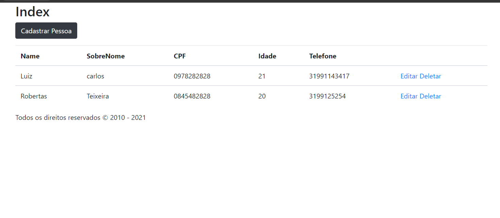
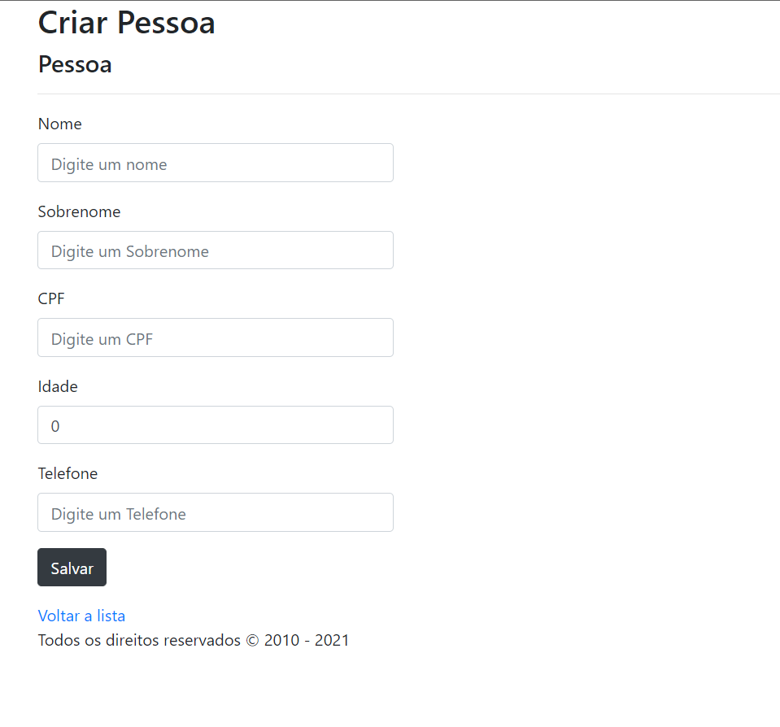

# ASPNET Core MVC - Crud de cadastro de Pessoa.

projeto básico de estudo, desenvolvimento de aplicações web com ASP.NET Core MVC
usando os  fundamentos e a utilização do framework.


<br />
<br />
serviços utilizadas:
CRUD Scaffolding</br>
Sql Server and migration</br>
Validation</br>


## 🖼 Screenshot das telas da aplicação <br/>
<p>Tela Inicial</p>
<br/>
<br/>
<p>lista De Pessoas</p>
<br/>
<br/>
<p>cadastro E edicao</p>
<br/>
<br/>
<p>exclusao De Pessoas</p>
<br/>
<br/>

<br/>


<br/>
## 🚀 Tecnologias utilizadas <br/>
<br/>


- C#  asp net<br/>
- Mysql <br/>
- html e css <br/>
- Razor <br/>
<br/>

## 🚀 Como usar <br/>

```bash

# na classe startup site01/sistema-de-banco-de-palavras/Startup.cs 
# e necessario caso deseja que seu banco de dados seja integrado, alterar este seguinte codigo, passando o provider do seu banco de dados: options.UseSqlServer("Password=123456;Persist Security Info=True;User ID=sa;Initial Catalog=Site01;Data Source=DESKTOP-PCE1A1P\\SQLEXPRESS;");

# Entrar numa IDE de sua preferência 


```


## Linkedin abaixo

<h4 align="center">
   Feito com Por   <a href="https://www.linkedin.com/in/luiz-carlos-b50693173/" target="_blank"> Luiz Carlos </a>
</h4>

</html>
